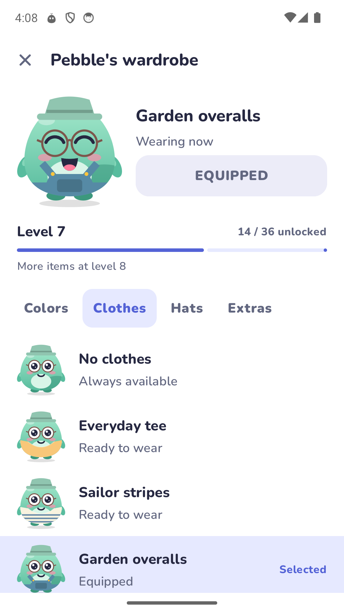

# Stillpoint

Make room for what you want to do.

Stillpoint helps you focus, limit distracting apps, and spend less time on your phone.
Pebble keeps you company through focus sessions and small daily goals.

**Free and open source. Focus works offline. No account, ads, or analytics.**

  

## Get Stillpoint

Stillpoint supports **Android 9 and later**. The first public release is in preparation.
When it is ready, you can download the APK from [Releases](https://github.com/agneswd/Stillpoint/releases).

Install the APK, open Stillpoint, and follow Pebble's setup guide.
Android may ask you to allow installation from your browser or file manager.

## Find your focus

- Start a timer, stopwatch, or Pomodoro session. Choose a scene and add a tag.
- Listen to gentle rain, waves, or white, pink, and brown noise from bundled recordings. All sounds work offline.
- Set daily goals. Earn XP, finish quests, and build a streak at your own pace.
- Choose from five animated scenes. Set the app to System, Light, or Dark in Settings.
- Add focus widgets to your home screen for a quick start.

## Make Pebble your own

Tap Pebble for a small reaction, even during a paused focus session.
Pebble also reacts to your recent focus habits. Rest days and streak freezes do not lower their mood.
Open **Pebble wardrobe** from Home or Progress to try a new look.

There are **36 level rewards across levels 1 to 20**, plus a hidden outfit to discover. Mix colors, clothes, hats, and accessories.
Preview locked items to see what comes next. Unlocked items cost no XP, and you can change them whenever you want.

 

Four daily quests rotate through 24 task templates. They cover focus time, completed sessions, your daily goal, and purpose or reflection.
Tap a quest to read its rules. Rewards enter your XP total automatically when you finish a quest.
The daily goal saved with your first session keeps that day's quest targets stable.

Earn 30 badges for progress such as completed sessions, steady practice, named tasks, and session notes.
Browse upcoming badges, earned badges, or a specific category in Progress.
Older earned badges stay in your collection.

## Put distractions on pause

Set daily app limits or block apps during focus. Use schedules for regular quiet times.
Give each schedule an icon, or let its start time choose one.
You can also block short-video feeds and selected websites.

Choose gentle limits with short passes, or strict sessions that prevent an early exit.
Strict mode depends on Android permissions. It cannot prevent force-stop, safe mode, or every uninstall method.

The optional notification inbox holds messages from apps you choose. Read them when you are ready,
or set delivery times for a summary.
Settings has separate switches for focus updates, planned reminders, and inbox summaries.

Short-video and website blocking depend on the screens that other apps expose.
Their updates can affect detection. Current YouTube compatibility still needs verification.

## See your progress

Review your focus time and phone use over a day, week, or month.
Choose productive apps and see how screen time divides between productive, distracting, and other apps.
Add session notes to remember what worked.

## Your data stays on your phone

Stillpoint stores settings, focus history, screen time, and held messages on your device.
It does not upload this data. Automatic Android backup is disabled.

Internet access is used only for GitHub update checks and APK downloads. Focus and blocking work without a connection.

You can save and restore a local backup in Settings. Backup files are not encrypted.
They include settings and history, but exclude held message text, active sessions, and temporary passes.
Keep them in a private location.

## Keep Stillpoint updated

Open **Settings > App updates** to check for a new release.
Automatic checks are enabled by default and run about once a day when Android permits. You can turn them off.

Choose Download to get an available update, then Install to open Android's installer.
Nothing downloads or installs automatically. Android asks you to confirm installation.
The app checks that the APK belongs to Stillpoint, has a newer version, and uses the same signing key.

## Permissions you control

| Permission | What it does |
| --- | --- |
| Usage access | Measures time spent in apps. |
| Accessibility | Detects blocked apps, websites, and supported short-video screens. |
| Notification access, optional | Holds notifications from the apps you select. |
| Notifications | Shows focus status and inbox summaries. |
| Alarms and reminders | Starts planned focus on time. Without this access, Android may delay reminders. |
| Install unknown apps, when updating | Lets Android open an update you chose to install. Each installation still needs your confirmation. |

On Android 13 and later, you may need to open Stillpoint's **App info** menu and choose
**Allow restricted settings** before enabling accessibility.

## Help and contribute

Found a problem? [Open an issue](https://github.com/agneswd/Stillpoint/issues).
Include your Android version and the steps that caused it. Do not attach private messages or backups.

To build the app or run device checks, see the [development guide](docs/development.md).
The [feature map](docs/regain-parity.md) tracks completed work and known gaps.

## License

Stillpoint code and original artwork use [GPL-3.0-only](LICENSE).
Nunito uses the [SIL Open Font License](licenses/Nunito-OFL.txt).
UI sounds by Kenney use [CC0](licenses/Kenney-Interface-Sounds-CC0.txt).
[Focus recordings](docs/focus-audio-sources.md) from Freesound also use CC0.
See [NOTICE](NOTICE) for attribution. License texts are included in the APK.
