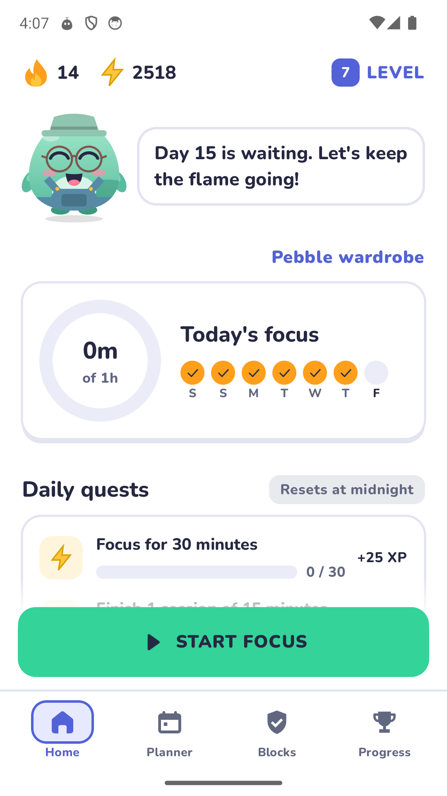
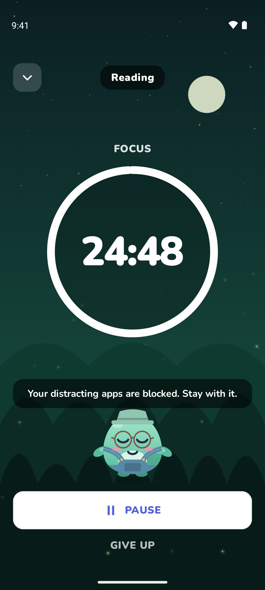
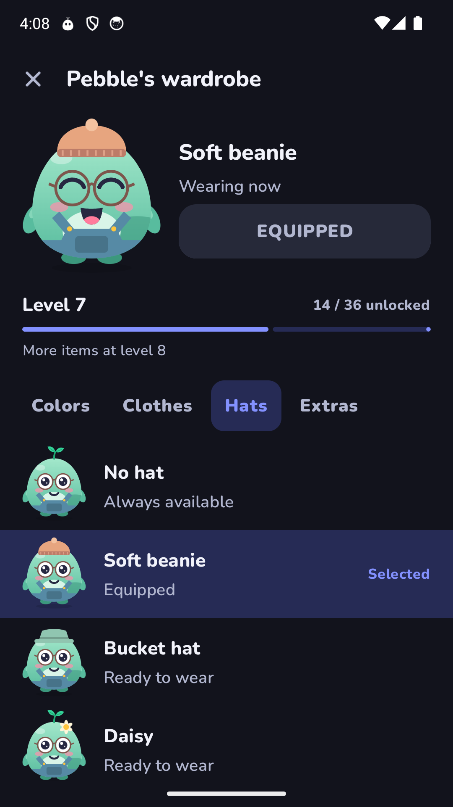
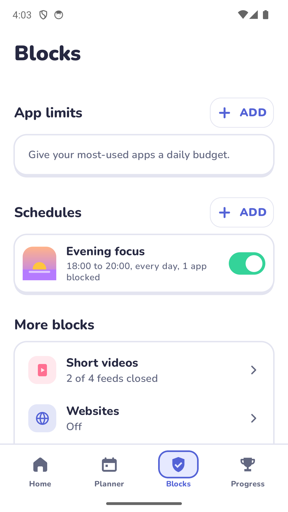
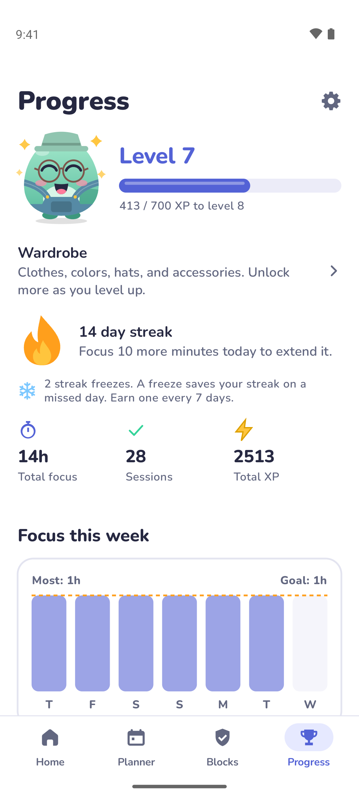

# Stillpoint

A focus app for Android, with a little company from Pebble.

Pick a task, block the apps that interrupt it, and start a session. Your focus time earns new clothes for Pebble,
daily quest rewards, and a record of the work you put in.

Free and open source. No account, ads, or analytics. Focus works offline.

  
  
  

## Get Stillpoint

Stillpoint supports **Android 9 and later**. Download the APK from the [latest release](https://github.com/agneswd/Stillpoint/releases/latest).

Open the APK. Android may ask you to allow installation from your browser or file manager.
Then follow Pebble's setup guide, choose your distracting apps, and start your first session.

## Make time for a task

Use a countdown timer, an open-ended stopwatch, or Pomodoro sessions with breaks.
Give the session a name, choose one of five animated scenes, and settle in.
Rain, waves, and white, pink, or brown noise are bundled with the app, so you can listen without a connection.

Save a note when you finish. Review your focus time by day, week, or month to see what worked.
Home-screen widgets let you start another session quickly. On Android 16 and later, the timer also shows in the status bar.

The app follows your phone's light or dark theme. You can also choose either theme in Settings.

## Give distractions a limit

Set daily app budgets or block selected apps while you focus. Create schedules for study, work, or bedtime,
with an icon you choose. Use short passes when you need flexibility, or a strict session that prevents an early exit.

Stillpoint can also hold selected app notifications in an inbox. Read them later or choose times for a summary.
Separate settings control focus updates, planned reminders, and inbox summaries.

  
  

Screen-time reports separate productive apps, distracting apps, and other apps. You choose which apps count as productive.
Tap a day in the last week to see which apps you used.
Your focus block list defines distracting apps.

Blocking needs Android permissions to work. Strict mode cannot prevent force-stop, safe mode, or every uninstall method.
Website and short-video detection also depend on what other apps expose. Current YouTube compatibility still needs verification.

## A wardrobe you earn

Pebble reacts when you tap and changes mood with your recent focus habits. Rest days and streak freezes protect that mood.
As you level up, unlock **36 colors, clothes, hats, and accessories across levels 1 to 20**.
There is also a hidden outfit to discover.

Open **Pebble wardrobe** from Home or Progress to try things on. Preview locked items before you earn them.
Wearing an unlocked item costs no XP, and you can change your outfit whenever you want.

Four daily quests rotate through 24 task templates. Some ask for focus minutes; others ask you to finish a named task
or reflect on a session. Tap a quest for its exact rules. Completed quests add their XP automatically.
There are also 33 badges for milestones in your focus time, sessions, and habits.

## Your data stays on your phone

Stillpoint keeps your settings, focus history, screen time, and held messages on your device. It does not upload them.
Automatic Android backup is disabled.

Internet access is used only to check GitHub for updates and download an update you choose.
Focus and blocking work without a connection.

Save a password-protected backup in Settings to move your settings and history to another phone.
Choose a password with at least 12 characters and keep it safe. Stillpoint cannot recover a forgotten password.
Backups exclude held message text, active sessions, and temporary passes. Restoring a backup does not refill used passes on the same phone.
Only encrypted Stillpoint backups are accepted; older unencrypted JSON files cannot be restored.

Which permissions does Stillpoint need?

| Permission | Purpose |
| --- | --- |
| Usage access | Measures time spent in apps. |
| Accessibility | Detects blocked apps, websites, and supported short-video screens. |
| Notification access, optional | Holds notifications from apps you select. |
| Notifications | Shows focus status, reminders, and summaries. |
| Alarms and reminders | Starts planned focus on time. Android may delay reminders without this access. |
| Install unknown apps, when updating | Opens an update you chose in Android's installer. You still confirm each installation. |

On Android 13 and later, open Stillpoint's **App info** menu and select **Allow restricted settings**
if Android blocks you from enabling accessibility.

## Updates

Open **Settings > App updates** to check for a release. Automatic checks are on by default and run about once a day,
when Android permits. You can turn them off.

Choose **Download**, then **Install**. Stillpoint checks the APK's identity, version, and signing key before opening Android's installer.
Nothing downloads or installs automatically.

## Help and contribute

[Report a problem](https://github.com/agneswd/Stillpoint/issues) with your Android version and steps to reproduce it.
Leave private messages and backups out of reports.

For builds and device checks, read the [development guide](docs/development.md).
The [feature map](docs/regain-parity.md) lists completed work and known gaps.

Stillpoint code and original artwork use [GPL-3.0-only](LICENSE).
Nunito uses the [SIL Open Font License](licenses/Nunito-OFL.txt).
[VCSL instrument recordings](licenses/VCSL-CC0.txt) and [Freesound focus recordings](docs/focus-audio-sources.md) use CC0.
See [NOTICE](NOTICE) for credits. License texts are also included in the app.
